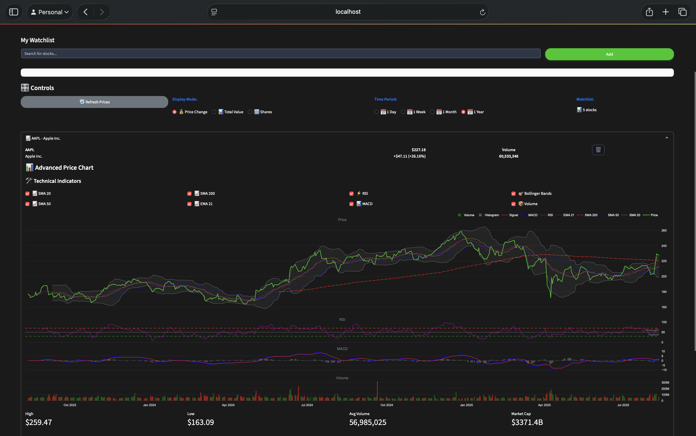
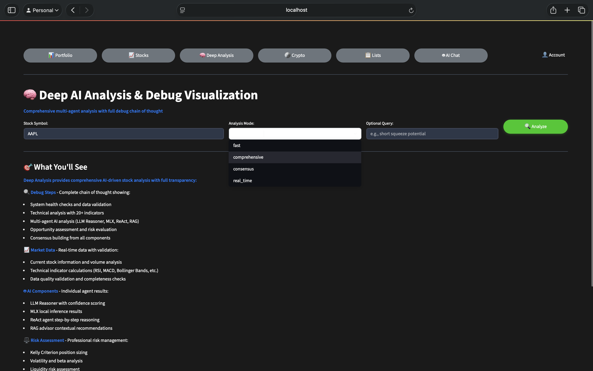
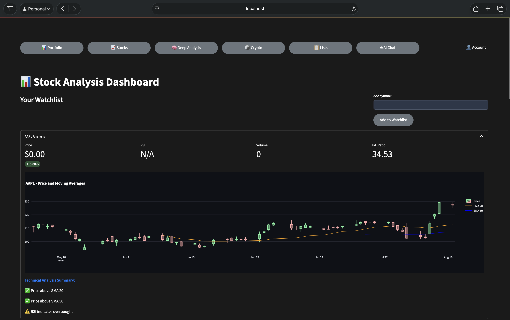
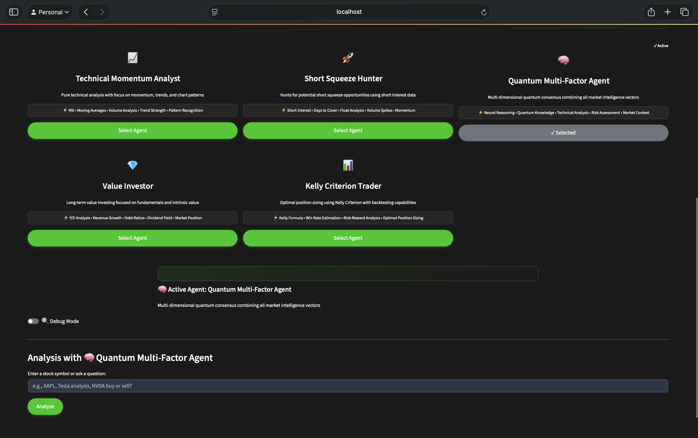
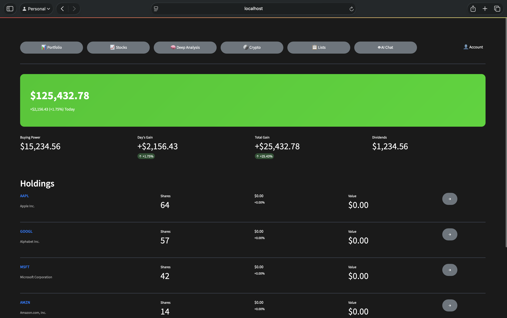
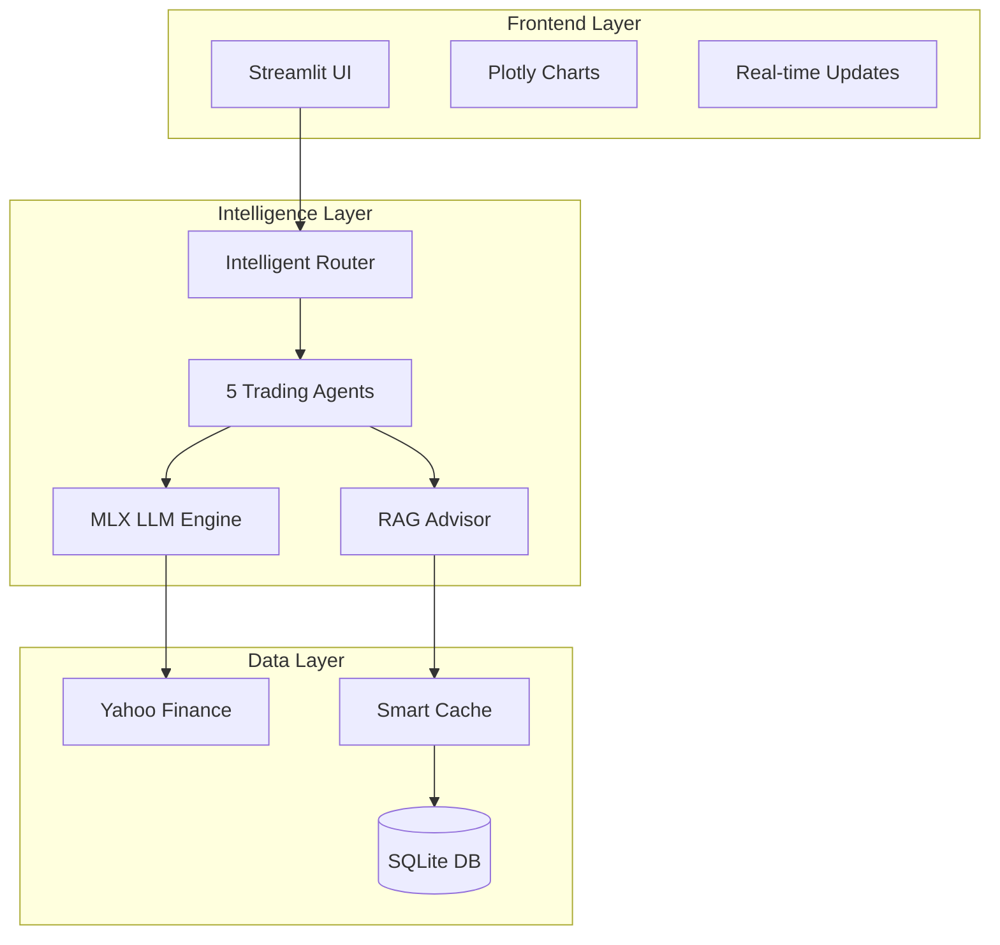

# 🚀 QuantumConsensus — Apple‑Level Trading Intelligence

> **Beautiful. Explainable. Local‑first.**  
> A modern Streamlit platform unifying quant math, MLX‑powered local LLM reasoning, and elegant dashboards for research‑grade trading decisions.

<p align="center">
  
</p>

<div align="center">
  
  [](https://www.python.org)
  [](https://streamlit.io)
  [](https://github.com/ml-explore/mlx)
  [](LICENSE)
  
</div>

<div align="center">
  <a href="#-features">Features</a> • 
  <a href="#-screens--explanations">Screens</a> • 
  <a href="#-quickstart">Quickstart</a> • 
  <a href="#-architecture">Architecture</a> •
  <a href="#-agents">Agents</a>
</div>

---

## ✨ Features

### 🎯 Core Capabilities

- **🧠 Advanced AI Analysis** — MLX‑optimized Llama 3.1 for sub‑200ms local inference
- **📊 Professional Charting** — 20+ technical indicators with institutional‑grade visualizations  
- **🤖 Multi‑Agent Consensus** — 5 specialized trading agents with quantum voting system
- **💼 Portfolio Management** — Real‑time P&L tracking with Robinhood‑style clarity
- **🔒 Privacy First** — 100% local processing, your data never leaves your machine
- **⚡ Apple Silicon Native** — Optimized for M1/M2/M3 with Metal acceleration

### 🎨 Design Philosophy

- **Streamlit‑native components** for reliability and speed
- **Dark theme optimized** with glass‑morphism effects  
- **Zero configuration** — works out of the box
- **Responsive layouts** that adapt to any screen size

---

## 🖼 Screens & Explanations

### 📈 Advanced Technical Analysis
<p align="center">
  
</p>

**Multi‑pane technical dashboard** featuring:
- Price action with SMA‑20/50/200 and EMA‑21 overlays
- Bollinger Bands for volatility analysis
- RSI/MACD oscillators in synchronized sub‑panels
- Volume profile with anomaly detection
- **Single‑screen situational awareness** optimized for rapid decision making

---

### 🧪 Deep AI Analysis Pipeline
<p align="center">
  
</p>

**Transparent AI reasoning** with:
- Analysis modes: `fast` (< 1s), `comprehensive` (full scan), `consensus` (multi‑agent), `real_time` (streaming)
- **Full pipeline visibility**: Data validation → Technical indicators → Agent reasoning → Risk gates → Final recommendation
- **Explainable AI** — see exactly why each decision was made
- Debug mode for complete reasoning traces

---

### 📊 Smart Watchlist Dashboard
<p align="center">
  
</p>

**Frictionless monitoring** featuring:
- Quick‑add symbols with autocomplete
- Live quotes with 5‑minute refresh
- Candlestick charts with volume overlays
- **Technical summary cards**: "Above SMA20/50", "RSI Overbought", "MACD Bullish Cross"
- One‑click deep analysis activation

---

### 🤖 Multi‑Agent Trading Intelligence
<p align="center">
  
</p>

**5 Specialized Trading Agents**:

| Agent | Strategy | Indicators | Best For |
|-------|----------|------------|----------|
| 📈 **Technical Momentum** | Trend following | RSI, MACD, Moving Averages | Trending markets |
| 🚀 **Short Squeeze Hunter** | Squeeze detection | Short Interest, Borrow Rate, Volume | High volatility plays |
| 🧠 **Quantum Multi‑Factor** | Neural reasoning | 15+ factors, ML scoring | Complex decisions |
| 💎 **Value Investor** | Fundamental analysis | P/E, PEG, Revenue Growth | Long‑term positions |
| 📊 **Kelly Criterion** | Optimal sizing | Win rate, Risk‑reward | Position management |

---

### 💼 Portfolio Excellence
<p align="center">
  
</p>

**Institution‑grade portfolio tracking**:
- **Hero metrics** — Total value, Day change, Total gain, Buying power
- **Smart holdings list** — Cost basis, Current value, P&L, Allocation %
- **Performance attribution** — See what's driving returns
- **Risk analytics** — Portfolio beta, Sharpe ratio, Max drawdown

---

## ⚡ Quickstart

### Prerequisites

- **macOS** with Apple Silicon (M1/M2/M3) for MLX acceleration
- **Python 3.9+**
- **8GB RAM** minimum (16GB recommended for AI features)

### Installation

```bash
# Clone the repository
git clone https://github.com/yrafique/quantum-consensus-trading.git
cd quantum-consensus-trading

# Install dependencies
pip3 install -r requirements.txt

# (Optional) Install MLX for Apple Silicon acceleration
pip3 install mlx mlx-lm

# Run the application
python3 quantum_start.py
```

### First Run

1. **Open your browser** to http://localhost:8501
2. **Add symbols** to your watchlist (try AAPL, NVDA, TSLA)
3. **Select an agent** on the AI Trading Agents page
4. **Enable Debug Mode** to see full reasoning traces
5. **Analyze a stock** by entering a symbol and clicking "Analyze"

---

## 🏗 Architecture

### System Design



### Key Components

| Component | Purpose | Technology |
|-----------|---------|------------|
| **Unified Analyzer** | Orchestrates all analysis components | AsyncIO, Circuit Breakers |
| **Agent Manager** | Routes queries to appropriate agents | LangGraph, Type Safety |
| **MLX Engine** | Local LLM inference | Apple MLX, Llama 3.1 |
| **Data Fetcher** | Real-time and historical data | yfinance, 5-min cache |
| **Risk Manager** | Position sizing and risk gates | Kelly Criterion, VaR |

---

## 🤖 Agent Deep Dive

### Technical Momentum Agent
```python
# Analyzes price momentum and trend strength
indicators = ['RSI', 'MACD', 'SMA_20', 'SMA_50', 'Volume_Ratio']
signals = ['Golden Cross', 'MACD Crossover', 'RSI Divergence']
```

### Short Squeeze Hunter
```python
# Detects potential short squeeze setups
factors = ['Short_Interest', 'Days_to_Cover', 'Borrow_Rate', 'Volume_Spike']
triggers = ['High SI + Volume', 'Rising Borrow Rate', 'Failed Breakdown']
```

### Quantum Multi‑Factor Agent
```python
# Neural network approach to factor analysis
factors = 15  # Technical, fundamental, sentiment
ml_models = ['XGBoost', 'Random Forest', 'Neural Net']
consensus_method = 'weighted_voting'
```

---

## 📚 Advanced Features

### Real‑time Analysis Modes

| Mode | Speed | Depth | Use Case |
|------|-------|-------|----------|
| **Fast** | < 1s | Basic indicators | Quick checks |
| **Standard** | 2-3s | Full technical | Daily trading |
| **Comprehensive** | 5-10s | All agents + ML | Deep research |
| **Real-time** | Streaming | Live updates | Day trading |

### Risk Management

- **Kelly Criterion** for optimal position sizing
- **Value at Risk (VaR)** calculations
- **Maximum drawdown protection**
- **Correlation‑based portfolio limits**

### Debug Mode Features

- Complete reasoning traces
- Intermediate calculation steps
- Agent voting breakdown
- Performance metrics
- Error diagnostics

---

## 🛠 Configuration

### Environment Variables

```bash
# MLX Configuration (Optional)
export MLX_LAZY_LOAD=1
export MLX_LLM_PATH=~/models/llama31-8b-instruct

# Streamlit Configuration
export STREAMLIT_THEME="dark"
export STREAMLIT_SERVER_PORT=8501
```

### Custom Settings

Edit `quantum_settings.json`:
```json
{
  "theme": "dark",
  "default_agent": "quantum_multi_factor",
  "cache_duration": 300,
  "debug_mode": false,
  "indicators": ["RSI", "MACD", "BB", "SMA", "EMA"]
}
```

---

## 🚀 Roadmap

### Coming Soon
- [ ] **WebSocket integration** for real‑time quotes
- [ ] **Backtesting engine** with walk‑forward analysis
- [ ] **Options flow analysis** with unusual activity detection
- [ ] **Sentiment analysis** from news and social media
- [ ] **Paper trading** mode with virtual portfolio

### Future Vision
- [ ] **Multi‑broker integration** (Alpaca, Interactive Brokers)
- [ ] **Cloud sync** for cross‑device access
- [ ] **Mobile app** with SwiftUI
- [ ] **Custom indicators** with Python scripting
- [ ] **Strategy marketplace** for sharing algorithms

---

## 🤝 Contributing

We welcome contributions! Please see our [Contributing Guide](CONTRIBUTING.md) for details.

### Development Setup

```bash
# Install dev dependencies
pip3 install -r requirements-dev.txt

# Run tests
pytest tests/

# Run linting
black src/
flake8 src/
```

---

## 📖 Documentation

- **[Technical Documentation](docs/TECHNICAL.md)** — Architecture deep dive
- **[API Reference](docs/API.md)** — Endpoint documentation  
- **[Agent Guide](docs/AGENTS.md)** — Agent strategies explained
- **[Deployment Guide](docs/DEPLOYMENT.md)** — Production setup

---

## 🔒 Security & Privacy

- **100% local processing** — No data leaves your machine
- **No API keys required** — Uses public Yahoo Finance data
- **Encrypted storage** — Local database encryption
- **No telemetry** — Zero tracking or analytics

---

## 📜 License

MIT License — See [LICENSE](LICENSE) for details

---

## 🙏 Acknowledgments

- **MLX Team** at Apple for incredible ML frameworks
- **Streamlit** for the amazing app framework
- **yfinance** for reliable market data
- **Open source community** for inspiration and support

---

<div align="center">
  
  **Built with ❤️ for traders who think different**
  
  <a href="https://github.com/yrafique/quantum-consensus-trading">⭐ Star on GitHub</a> • 
  <a href="https://github.com/yrafique/quantum-consensus-trading/issues">Report Bug</a> • 
  <a href="https://github.com/yrafique/quantum-consensus-trading/pulls">Contribute</a>
  
  <sub>Local, private, and lightning fast — Your Mac is the trading floor</sub>
  
</div>